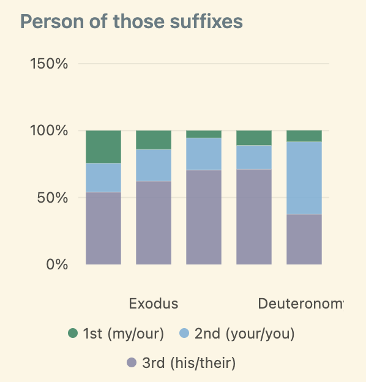

# bibCount

Word-level index of the Hebrew Bible (Tanakh) from the [Open Scriptures Hebrew Bible](https://github.com/openscriptures/morphhb): Westminster Leningrad Codex text plus verified morphology.

Each graphic word is one occurrence. Prefixes such as **ה** / **ל** / **ב** / **ו** / **כ** / **מ** / **ש** are split using OSHB lemma codes (`d/776` → article + ארץ). Suffixes come from the morphology (`/Sp3ms` and the trailing `/וֹ` segment).

## Packed structure

Occurrences are a NumPy structured array (~44 bytes each), memory-mapped on load. Repeated Hebrew strings live in intern tables (one copy per unique surface, stem, lemma, prefix, suffix). Inverted lists give O(1) first-hit and count.

Each occurrence stores:

| Field | Meaning |
| --- | --- |
| `id` | Unique instance ID (Tanakh order, 1-based) |
| `surface_id` | Unique ID of the full pointed word |
| `stem_id` / `stem_cons_id` | Unique IDs of the root without prefix/suffix |
| `lemma_id` | Unique ID of the OSHB/Strong's root |
| book, chapter, verse, `word_in_verse` | Pasuk location |
| `parasha_id` | Weekly Torah portion (0 outside the Torah) |
| `prev_id` / `next_id` | Neighboring words |

## License of the source

- WLC Hebrew text: public domain
- OSHB lemmas and morphology: [CC BY 4.0](https://creativecommons.org/licenses/by/4.0/) — credit the Open Scriptures Hebrew Bible Project
- Parasha ranges: derived from [hebcal-leyning](https://github.com/hebcal/hebcal-leyning)

## Build

```bash
python3 -m venv .venv
source .venv/bin/activate
pip install -e .
python -m bibcount build
```

## Query

`--by surface` matches the full graphic word. `--by root` (and `--with-prefix` / `--no-prefix`) uses the Strong's lemma of that stem, so הארץ, בארץ, and ארצה count together. `--by lemma` takes a Strong's number directly (`776`).

```bash
python -m bibcount first ארץ --by root          # Genesis 1:1 הָאָרֶץ
python -m bibcount count ארץ --by root          # 2504 (H776)
python -m bibcount count ארץ --by root --with-prefix
python -m bibcount count ארץ --by root --no-prefix --no-suffix
python -m bibcount find הארץ --limit 5
python -m bibcount show 1
python -m bibcount plot
python -m bibcount names
# or: python scripts/plot_word_scree.py
```

The plot is the Five Books only. Each column is one root, left to right in the order it first appears. Vertical position is the pasuk (Genesis at the top). Marks below the red line are later uses; the region above the line is empty because that root has not been introduced yet.

Name posters and the scree group by **prefix-stripped form** (ו, ה, ל, ב, כ, מ, ש removed; conjugations and suffixes kept). `python -m bibcount names` writes `word_names.png` in first-appearance order; `--by frequency` writes `word_names_freq.png`.

```python
from bibcount import TanakhIndex, parsed_dir

idx = TanakhIndex.load(parsed_dir())
hit = idx.first("ארץ", by="root")
print(hit.pasuk, hit.surface, hit.prev.surface, hit.next.surface)
print(idx.count("ארץ", by="root"))
print(idx.count("ארץ", by="root", with_prefix=False, with_suffix=False))
```

## Preview

<p align="center">
  
</p>

